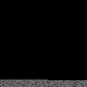

# SCode
Under development text to bitmap converter. SCode convert text files to bitmap squares and with lossless image compression techniques hope to turn text files into much smaller image file. Compressing the text file gradually into the smallest file without loss of data.

## Examples
A text about programming taken from *Wikipedia*:



## Download
You can download the released (or pre-released) version of this software [here](https://github.com/SkyDriver2500/square-code/releases/download/v0.1/scode-0.1.tar.gz).

## Preparing the development version
This project uses autotools to generate the building files.
```
~$ aclocal
~$ autoconf
~$ automake --add-missing
```

## Installing the dist version
To install the dist version run:
```
~$ ./configure
~$ make
~$ make install
```
**Note:** Make sure you have permissions to run `make install`.

## Running SCode
```
Usage:
  scode sourcefile destination.bmp
```
**Note:** Files are saved under the users home directory.

# About bitmaps
For this project these tables are a useful reference if you are planning on editing the bitmap generation.

## File Header
| Position | Name | Size | Standard Value | Description |
| ---:| --- | --- |:---:| --- |
| 1 | bfType | 2 Bytes | 0x4D42 | Most of the time is set to 'BM' (0x4D42 in hex) to declare it is a .bmp bitmap file. |
| 3 | bfSize | 4 Bytes | ---- | Size of the file in Bytes |
| 7 | bfReserved1 | 2 Bytes | 0 | Reserved. |
| 9 | bfReserved2 | 2 Bytes | 0 | Reserved. |
| 11 | bfOffBits | 4 Bytes | ---- | Offset from the beginnning of the file to the bitmap data. bfSize minus the size of the data.  |

## Information Header

| Position | Name | Size | Standard Value | Description |
| ---:| --- | --- |:---:| --- |
| 15 | biSize | 4 Bytes | 40 | Size of the Information Header in bytes. |
| 19 | biWidth | 4 Bytes | ---- | Width of the image in pixels. |
| 23 | biHeight | 4 Bytes | ---- | Height of the image in pixels. |
| 27 | biPlanes | 2 Bytes | ---- | Number of planes of the target device. |
| 29 | biBitCount | 2 Bytes | ---- | Number of bits per pixel. |
| 31 | biCompression | 4 Bytes | 0 | Type of compression, set to 0 for no compression. |
| 35 | biSizeImage | 4 Bytes | 0 | Size of the image in bytes, can be set to 0. |
| 39 | biXPelsPerMeter | 4 Bytes | 0 | Number of horizontal pixels per meter on the target device. Usually set to 0. |
| 43 | biYPelsPerMeter | 4 Bytes | 0 | Number of vertical pixels per meter on the target device. Usually set to 0. |
| 47 | biClrUsed | 4 Bytes | 0 | Number of colors used in the bitmap. Set to 0 for it to be calculated using biBitCount. |
| 51 | biClrImportant | 4 Bytes | 0 | Number of colors that are "important" for the bitmap. Set to 0 for all colors to be "important". |

## RGB Data
For bitmaps with 8 Bits per pixel.

| Position | Name | Size | Range | Description |
| ---:| --- | --- |:---:| --- |
| 1 | b | 1 Byte | 0x00 - 0xff | Blue |
| 2 | g | 1 Byte | 0x00 - 0xff | Green |
| 3 | r | 1 Byte | 0x00 - 0xff | Red |

# License
Check LICENSE file for more information.
